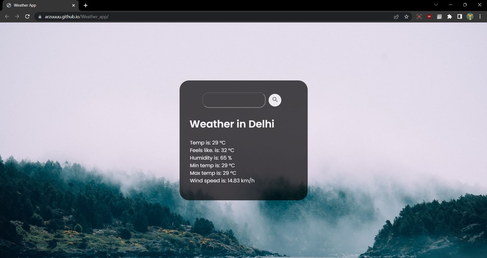

# Weather App

A simple weather application that provides current weather information for any given city. It utilizes the Rapid API to retrieve weather data and displays various weather parameters such as temperature, humidity, wind speed, and more.

## Installation

1. Clone the repository: `git clone https://github.com/Arzuuuu/Weather_app.git`
2. Open the project directory: `cd Weather_app`
3. Open the index.html file in a web browser.

## Usage

1. Enter the name of a city in the search bar.
2. Click the search button or press Enter to retrieve the weather information for the specified city.
3. The app will display the current temperature, feels like temperature, humidity, minimum temperature, maximum temperature, wind speed for the given city.

## API Key

To use this weather app, you need to obtain an API key from Rapid API. Follow these steps:

1. Sign up for a Rapid API account at https://rapidapi.com.
2. Search for the "Weather API" and subscribe to a suitable plan.
3. Retrieve your API key from the Rapid API dashboard.
4. Open the `script.js` file in the project.
5. Locate the `options` object and replace the value of the "X-RapidAPI-Key" header with your API key.

## Technologies Used

- HTML
- CSS
- JavaScript
- Rapid API (Weather API)

## Screenshots

## Author

- Arzu
- GitHub: https://github.com/Arzuuuu
- Website: https://arzuuuu.github.io/Weather_app/

## Acknowledgments

- [Rapid API](https://rapidapi.com) for providing the Weather API.

